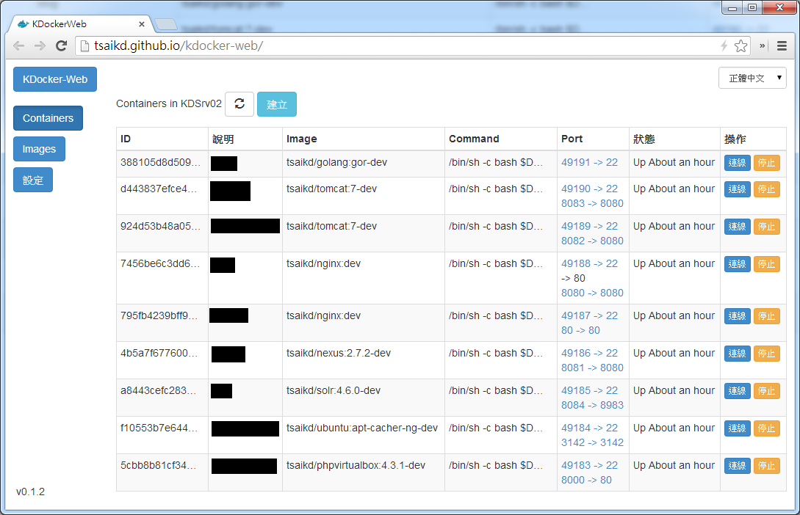

kdocker-web [](http://badge.fury.io/gh/tsaikd%2Fkdocker-web)
===========
[](https://david-dm.org/tsaikd/kdocker-web)
[](https://david-dm.org/tsaikd/kdocker-web#info=devDependencies)
[](https://travis-ci.org/tsaikd/kdocker-web)
[](http://gruntjs.com/)

Docker simple web UI

[Shipyard]: https://github.com/shipyard/shipyard
[Docker]: https://www.docker.io/
[Docker Remote API]: http://docs.docker.io/en/latest/reference/api/docker_remote_api/
[Mat Lee]: http://www.hackingthursday.org/user:matlinuxer2

## DEMO

http://tsaikd.org/kdocker-web/

## Config Docker Startup Options (Ubuntu)

* /etc/default/docker

```
DOCKER_OPTS="--api-enable-cors=true -H tcp://0.0.0.0:2375 -H unix:///var/run/docker.sock"
```

## Config Docker Startup Options (Boot2Docker on Mac), thanks [scourgen](https://github.com/tsaikd/kdocker-web/issues/2)

* /var/lib/boot2docker/profile

```
EXTRA_ARGS="--api-enable-cors"
```

## Config Docker Startup Options (CoreOS)

* /var/lib/coreos-install/user_data (Cloud-Config)
	* http://coreos.com/docs/launching-containers/building/customizing-docker/

```
#cloud-config

coreos:
  units:
    - name: docker.service
      command: restart
      content: |
        [Unit]
        Description=Docker Application Container Engine
        Documentation=http://docs.docker.io

        [Service]
        Environment="TMPDIR=/var/tmp/"
        ExecStartPre=/bin/mount --make-rprivate /
        # Run docker but don't have docker automatically restart
        # containers. This is a job for systemd and unit files.
        ExecStart=/usr/bin/docker -d -s=btrfs -r=false -H fd:// --api-enable-cors=true

        [Install]
        WantedBy=multi-user.target
    - name: docker-tcp.socket
      command: start
      content: |
        [Unit]
        Description=Docker Socket for the API

        [Socket]
        ListenStream=2375
        Service=docker.service
        BindIPv6Only=both

        [Install]
        WantedBy=sockets.target
    - name: enable-docker-tcp.service
      command: start
      content: |
        [Unit]
        Description=Enable the Docker Socket for the API

        [Service]
        Type=oneshot
        ExecStart=/usr/bin/systemctl enable docker-tcp.socket
```

## Install

In fact, you can open http://tsaikd.org/kdocker-web/ instead of installation. :D

Just put the whole project to any web site, like: nginx, apache.

Open your browser and go to the project folder.

Enjoy!

Method 2: (If you installed python)

```
python -m SimpleHTTPServer 9527
```

Method 3 by [Mat Lee]: (If you installed php command line)

```
KDPORT="127.0.0.1:9527"; ( php -S $KDPORT -t `git rev-parse --show-toplevel` &) ; "xdg-open http://$KDPORT"
```

## Warning

There is no any authentication in the project.

Please use the firewall for security by hand.

========================================================================================
# 中文版開始

## Docker 設定 (Ubuntu)

* /etc/default/docker

```
DOCKER_OPTS="-api-enable-cors=true -H tcp://0.0.0.0:2375 -H unix:///var/run/docker.sock"
```

	* -api-enable-cors=true 是為了要在 Browser 直接連 [Docker Remote API]
	* -H tcp://0.0.0.0:2375 是要監聽所有網卡的 2375 Port
	* 更多的設定項目請參考 [Docker] 官網

## Docker 設定 (Boot2Docker on Mac), 感謝 [scourgen](https://github.com/tsaikd/kdocker-web/issues/2)

* /var/lib/boot2docker/profile

```
EXTRA_ARGS="--api-enable-cors"
```

## Docker 設定 (CoreOS)

* /var/lib/coreos-install/user_data (Cloud-Config)
	* http://coreos.com/docs/launching-containers/building/customizing-docker/

```
#cloud-config

coreos:
  units:
    - name: docker.service
      command: restart
      content: |
        [Unit]
        Description=Docker Application Container Engine
        Documentation=http://docs.docker.io

        [Service]
        Environment="TMPDIR=/var/tmp/"
        ExecStartPre=/bin/mount --make-rprivate /
        # Run docker but don't have docker automatically restart
        # containers. This is a job for systemd and unit files.
        ExecStart=/usr/bin/docker -d -s=btrfs -r=false -H fd:// --api-enable-cors=true

        [Install]
        WantedBy=multi-user.target
    - name: docker-tcp.socket
      command: start
      content: |
        [Unit]
        Description=Docker Socket for the API

        [Socket]
        ListenStream=2375
        Service=docker.service
        BindIPv6Only=both

        [Install]
        WantedBy=sockets.target
    - name: enable-docker-tcp.service
      command: start
      content: |
        [Unit]
        Description=Enable the Docker Socket for the API

        [Service]
        Type=oneshot
        ExecStart=/usr/bin/systemctl enable docker-tcp.socket
```

## 安裝

事實上，你可以直接打開 http://tsaikd.org/kdocker-web/

直接就可以用，省下一整個安裝的過程。 ^_^

把整個 Project 丟到 nginx 或是 apache 之類的目錄

用瀏覽器直接連網址就可以了

一開始會跳到設定頁面去設定 [Docker Remote API] 的參數

重新載入頁面就可以用了

第二種方式，用 python 內建的 http server

```
python -m SimpleHTTPServer 9527
```

[Mat Lee] 另外提供了一個單行指令給大家參考:

```
KDPORT="127.0.0.1:9527"; ( php -S $KDPORT -t `git rev-parse --show-toplevel` &) ; "xdg-open http://$KDPORT"
```

## 注意

因為還沒做使用者認證的部份

就自行用防火牆來處理安全性的問題吧

## 參考畫面



## KD 碎碎唸

本來都用 [Shipyard] 在管 [Docker]

不過最近(2014/02) [Shipyard] 改版把架構弄複雜了, 用起來很不爽

只好自己硬幹一個簡單版的管理介面

目前是純 HTML

但是有用 WebSocket

所以還是要放到 Web Server 上面才能跑
